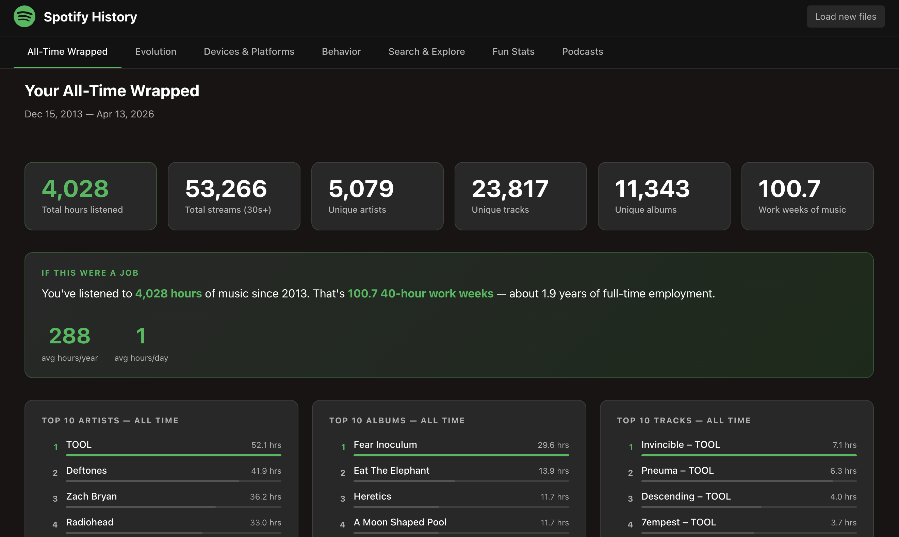

# Spotify Streaming History Visualizer

Visualize your Spotify Extended Streaming History — entirely in your browser.



> **Privacy first:** Your data never leaves your machine. No backend, no uploads, no tracking. All parsing and computation happens client-side. Exception: if you opt into genre analysis, the names of your top 50 artists are sent to Anthropic using an API key you supply — no listening history or personal data, just artist names.

---

## Getting your data

1. Go to [Spotify Privacy Settings](https://www.spotify.com/account/privacy/)
2. Scroll to **Download your data** and request **Extended streaming history**
3. Spotify will email you a download link — this can take a few days
4. Unzip the file; look for files named `Streaming_History_Audio_*.json`

## Running locally

```bash
npm install
npm start        # opens at http://localhost:5173
```

## How to use

Drag and drop your `Streaming_History_Audio_*.json` files onto the loader. The app parses them instantly and shows a multi-tab dashboard with listening stats, top artists, tracks, albums, hourly/weekly patterns, podcast history, and a search tool.

## Tech stack

- React 19
- Vite 8
- Recharts
- Tailwind CSS 4
- date-fns

## Contributing / extending

See [`CLAUDE.md`](./CLAUDE.md) for the full architecture guide — data flow, critical invariants, how to add new stats or charts, and styling conventions.

## License

MIT
